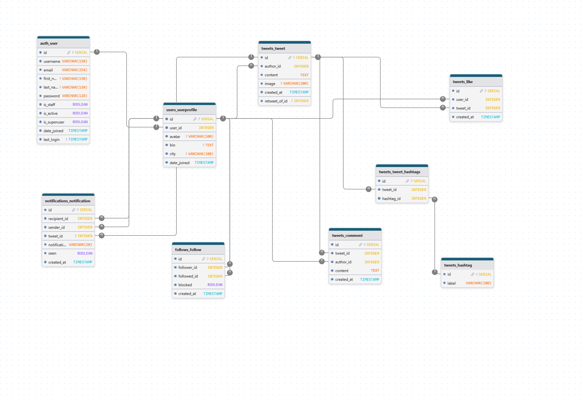

# X (Twitter) Clone - Réseau Social Django

Un clone de Twitter développé avec Django, offrant les fonctionnalités essentielles d'un réseau social moderne.

## Fonctionnalités

- **Authentification** : Inscription, connexion, profils utilisateurs
- **Publications** : Création, modification, suppression de tweets
- **Interactions** : Likes, commentaires, retweets
- **Suivi** : Système de followers/following
- **Notifications** : Notifications en temps réel
- **Recherche** : Recherche d'utilisateurs et de contenu

## Architecture de la Base de Données



## Lancement avec Docker

### Prérequis
- Docker
- Docker Compose

### Installation

1. **Cloner le projet**
   ```bash
   git clone <votre-repo>
   cd X_(Twitter)
   ```

2. **Créer le fichier d'environnement**
   ```bash
   cp .env.example .env
   ```
   
   Ou créer un fichier `.env` avec :
   ```env
   SECRET_KEY=django-insecure-your-secret-key-here
   DEBUG=1
   DB_NAME=boutique_db
   DB_USER=boutique_user
   DB_PASSWORD=boutique_password
   ```

3. **Construire et lancer les conteneurs**
   ```bash
   docker-compose up --build
   ```

4. **Appliquer les migrations**
   ```bash
   docker-compose exec web python manage.py migrate
   ```

5. **Peupler la base de données avec des données de test**
   ```bash
   docker-compose exec web python manage.py quick_populate --clear
   ```

6. **Créer un superutilisateur**
   ```bash
   docker-compose exec web python manage.py createsuperuser
   ```

### Accès à l'application

- **Application** : http://localhost:8000
- **Admin Django** : http://localhost:8000/admin
- **Base de données PostgreSQL** : localhost:5432

### Commandes utiles

```bash
# Arrêter les conteneurs
docker-compose down

# Voir les logs
docker-compose logs -f
```

## Développement

### Structure du projet
```
social_media/
├── core/             # Fonctionnalités principales
├── users/            # Gestion des utilisateurs
├── tweets/           # Gestion des tweets
├── follows/          # Système de suivi
├── notifications/    # Système de notifications
├── static/           # Fichiers statiques
├── templates/        # Templates HTML
└── manage.py
```

### Technologies utilisées

- **Backend** : Django, PostgreSQL
- **Frontend** : HTML, CSS, JavaScript, Tailwind
- **Containerisation** : Docker, Docker Compose
- **Base de données** : PostgreSQL

## Utilisation

1. Créez un compte ou connectez-vous
2. Complétez votre profil
3. Commencez à publier des tweets
4. Suivez d'autres utilisateurs
5. Interagissez avec les publications (likes, commentaires, retweets)

*Hicham et Léon*